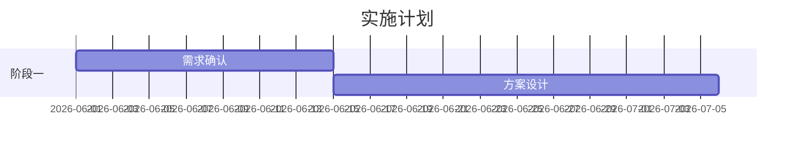

# /bid — 投标管理 + 售前工作台

跟踪投标全过程，同时作为售前工作的指挥中心。

## 定位

| Skill | 职责 | 输出 |
|-------|------|------|
| `/prospect` | 线索管理 — 售前线索跟踪 | 线索文档 |
| `/bid` | **投标管理 + 售前工作台** | 投标档案文件夹 |
| `/initiate` | 项目立项 — 中标后创建项目 | 项目结构 |

**典型工作流**:

```
/prospect 线索推进到方案沟通
    ↓
/bid 创建投标档案（action=new）
    ↓
↓ 售前阶段（循环迭代）↓
/bid 更新「客户需求分析」（首次需求对接）
/bid 更新「解决方案」（方案成形）
/bid action=material（材料版本管理）
/bid 更新「技术交流记录」（每次技术交流后）
    ↓
/bid action=lock（锁定合同内容）
    ↓
/bid 更新「商务报价」（Excel测算后录入关键数字）
    ↓
/bid action=result（记录投标结果）
    ↓
【中标】→ /initiate 立项
```

---

### 投标状态推导

AI 不静默设置投标状态。每次操作后，通过双提议建议下一状态，用户确认或纠正。

**状态定义**（详见 SCHEMA.md §4）：

| 状态 | 触发条件 |
|------|----------|
| `needs-analysis` | `/bid action=new` 后 |
| `solution-drafting` | 首次更新 `解决方案.md` 内容后 |
| `solution-communicating` | `/bid action=material` 材料标记已发客户后 |
| `tech-exchange-loop` | `/meeting type=tech-exchange` 完成后 |
| `requirement-locked` | `/bid action=lock` 完成后 |
| `priced` | 更新 `商务报价.md`（lock 之后） |
| `submitted` | 用户确认标书已递交后 |
| `won` / `lost` | `/bid action=result` 完成后 |

**推导方法**：每次操作前，AI 读取投标档案中已有文件判断当前状态；操作完成后，在双提议中建议下一状态。

---

## Behavior

### Step 0: 确定动作

| action | 行为 |
|--------|------|
| `new`（默认）| 创建完整投标档案（含售前文档） |
| `update` | 更新投标档案中的某个文档 |
| `material` | 管理售前材料版本和客户反馈 |
| `lock` | 锁定合同内容 |
| `result` | 记录投标结果 |

---

### Step 1: 新建投标档案（action=new）

#### 1a. 关联线索

如提供 `prospect` 参数：

```bash
obsidian read path="线索池/线索-{客户}-{主题}.md"
```

未提供时，搜索线索池：

```bash
obsidian search query="type/prospect"
obsidian files folder="线索池"
```

列出阶段为 "方案沟通" 或 "商务谈判" 的线索供选择。

#### 1b. 创建投标档案结构

创建文件夹：`投标档案/投标-{客户}-{主题}-{日期}/`

**基础文档**：

1. `招标要求.md`
2. `客户需求分析.md` ← 【售前新增】
3. `解决方案.md` ← 【售前新增】
4. `技术方案.md`
5. `商务报价.md`
6. `投标结果.md`

**售前子目录**：

```
投标档案/投标-{客户}-{主题}-{日期}/
├── 售前材料/              ← 【新增】存放PPT/Word/Excel
│   └── .gitkeep
├── 技术交流记录/          ← 【新增】每次技术交流一条记录
│   └── .gitkeep
├── 需求冻结/              ← 【新增】签字确认文件
│   └── .gitkeep
├── 招标要求.md
├── 客户需求分析.md
├── 解决方案.md
├── 技术方案.md
├── 商务报价.md
└── 投标结果.md
```

#### 1c. 招标要求.md

```markdown
---
title: "招标要求"
type: bid
bid_type: 公开招标 | 邀请招标 | 竞争性谈判
bid_date: YYYY-MM-DD
budget_limit: {{预算限价}}
client: "{{客户}}"
project: "{{主题}}"
tags:
  - type/bid
  - status/active
---

# 招标要求 — {客户} {主题}

## 招标基本信息

- 招标编号：
- 发布时间：
- 投标截止：
- 开标时间：
- 预算限价：{{金额}}万

## 资质要求

[对投标人资质的要求]

## 技术需求要点

[核心技术需求]

## 评分标准

| 评分项 | 权重 | 说明 |
|--------|------|------|
| 技术方案 | 40% | |
| 商务报价 | 30% | |
| 项目经验 | 20% | |
| 服务承诺 | 10% | |

## 关键时间节点

- [ ] YYYY-MM-DD：购标书
- [ ] YYYY-MM-DD：现场踏勘
- [ ] YYYY-MM-DD：提疑截止
- [ ] YYYY-MM-DD：投标截止
```

#### 1d. 客户需求分析.md ← 【售前核心文档】

```markdown
---
title: "客户需求分析"
type: bid
client: "{{客户}}"
project: "{{主题}}"
tags:
  - type/bid
---

# 客户需求分析 — {客户} {项目名}

> 首次对接日期：YYYY-MM-DD | 最后更新：YYYY-MM-DD

## 基本信息

- 客户行业：
- 客户规模：
- 对接人：
- 对接人职务：
- 对接人角色：□决策人 □技术负责人 □使用部门 □其他

## 业务痛点

| 痛点 | 严重程度 | 客户原话 | 备注 |
|------|----------|----------|------|
| | 高/中/低 | | |

## 业务流程

[客户的核心业务流程是什么]

## 决策链

- 决策人：
- 技术拍板人：
- 使用部门：
- 可能反对的人：

## 技术约束

- 必须兼容的系统：
- 技术偏好（客户明确要求的）：
- 技术红线（不能接受的）：

## 竞争态势

- 客户正在对比的供应商：
- 客户倾向谁：
- 我们的机会点：

## 关键需求清单

| 需求 | 优先级 | 客户描述 | 我们能否满足 |
|------|--------|----------|--------------|
| | P0/P1/P2 | | 是/否/待确认 |

## 下次跟进计划

- 时间：
- 议题：
- 需准备：
```

#### 1e. 解决方案.md ← 【售前核心文档】

```markdown
---
title: "解决方案"
type: bid
client: "{{客户}}"
project: "{{主题}}"
tags:
  - type/bid
---

# 解决方案 — {客户} {项目名}

> 状态：构思中 / 初稿 / 已定稿
> 版本：v1 | 更新日期：YYYY-MM-DD

## 方案概述

[一句话描述如何解决客户的核心痛点]

## 客户痛点 vs 我们的方案

| 痛点 | 我们的解法 | 给客户带来的价值 |
|------|-----------|-----------------|
| 痛点1 | 方案A | 效率提升X% |

## 产品/服务配置

### 核心产品

| 产品 | 规格 | 数量 | 部署方式 |
|------|------|------|----------|
| | | | |

### 定制开发

| 开发项 | 工时 | 负责人 |
|--------|------|--------|
| | | |

## 实施路线图（可选）



## 风险与应对

| 风险 | 概率 | 影响 | 应对措施 |
|------|------|------|----------|
| | | | |

## 成功案例

- [[PJ-xxx]] — 同行业客户，解决了类似问题
- 效果：

## 方案版本记录

| 版本 | 日期 | 主要变化 | 备注 |
|------|------|----------|------|
| v1 | YYYY-MM-DD | 初稿 | |
```

#### 1f. 技术方案.md

```markdown
---
title: "技术方案"
type: bid
tags:
  - type/bid
---

# 技术方案 — {客户} {主题}

## 总体架构

[技术架构描述]

## 实施方案

[实施计划]

## 团队配置

| 角色 | 人数 | 资质要求 |
|------|------|----------|
| 项目经理 | 1 | PMP |

## 关键技术点

[与竞争对手的差异化技术点]
```

#### 1g. 商务报价.md

```markdown
---
title: "商务报价"
type: bid
total_price:
cost_breakdown:
profit_margin:
tags:
  - type/bid
---

# 商务报价 — {客户} {主题}

## 报价汇总

| 项目 | 金额（万） |
|------|-----------|
| 人力成本 | |
| 分包成本 | |
| 管理成本 | |
| 其他成本 | |
| **合计成本** | |
| 利润 | |
| **报价** | |

## 付款条件

[与招标要求的对照]

## 报价版本记录

| 版本 | 日期 | 金额 | 利润率 | 审批状态 |
|------|------|------|--------|----------|
| v1 | YYYY-MM-DD | | | 待审批 |
```

#### 1h. 投标结果.md

```markdown
---
title: "投标结果"
type: bid
status: pending
result:
tags:
  - type/bid
---

# 投标结果 — {客户} {主题}

## 结果

- [ ] 中标
- [ ] 未中标

## 中标信息

- 中标金额：
- 中标单位：

## 未中标分析

- 中标单位：
- 中标金额：
- 我方排名：
- 未中标原因：

## 经验教训

[本次投标的经验教训]
```

#### 1i. 创建子目录

```bash
obsidian create path="投标档案/投标-{客户}-{主题}-{日期}/售前材料/.gitkeep" content=""
obsidian create path="投标档案/投标-{客户}-{主题}-{日期}/技术交流记录/.gitkeep" content=""
obsidian create path="投标档案/投标-{客户}-{主题}-{日期}/需求冻结/.gitkeep" content=""
```

#### 1j. 写入基础文档

```bash
obsidian create path="投标档案/投标-{客户}-{主题}-{日期}/招标要求.md" content="..."
obsidian create path="投标档案/投标-{客户}-{主题}-{日期}/客户需求分析.md" content="..."
obsidian create path="投标档案/投标-{客户}-{主题}-{日期}/解决方案.md" content="..."
obsidian create path="投标档案/投标-{客户}-{主题}-{日期}/技术方案.md" content="..."
obsidian create path="投标档案/投标-{客户}-{主题}-{日期}/商务报价.md" content="..."
obsidian create path="投标档案/投标-{客户}-{主题}-{日期}/投标结果.md" content="..."
```

#### 1k. 双提议

```markdown
✓ 确定性链接已自动建立：
- [[线索-{客户}-{主题}]] — 来源线索（prospect 参数已指定）
- [[客户档案-{client}]] — 客户档案（如存在）

提议 1 — 关联建议：
1. [[知识库/合同范本/]] — 历史同类项目合同参考

提议 2 — 售前工作流建议：
1. 是否立即录入首次需求对接内容？（更新「客户需求分析.md」）
2. 是否关联下游合作团队？（如需联合投标）

🏷️ 投标状态建议：→ needs-analysis（新建投标档案）

请回复编号确认，或纠正状态，或"跳过"
```

---

### Step 2: 更新投标（action=update）

#### 2a. 选择投标档案

```bash
obsidian files folder="投标档案"
```

列出投标档案供选择。

#### 2b. 选择要更新的文档

```
要更新哪个文档？
1. 客户需求分析.md
2. 解决方案.md
3. 技术方案.md
4. 商务报价.md
5. 其他（请指定）
```

#### 2c. 读取并更新

```bash
obsidian read path="投标档案/投标-{客户}-{主题}-{日期}/{选择的文档}.md"
```

根据用户输入，append 或 overwrite 对应内容。

#### 2d. 双提议

读投标档案已有文件，推导当前状态后：

```markdown
提议 1 — 关联建议：
1. 本次更新是否影响关联文档？（如 解决方案.md 更新后需同步更新 客户需求分析.md）
2. 是否需更新 售前材料清单.md 中的相关内容？

提议 2 — 后续行动：
1. 是否安排下一次技术交流？
2. 🏷️ 投标状态建议：当前 {derived_state} → 建议 {next_state}（基于本次更新内容）

请回复编号确认，或纠正状态，或"跳过"
```

---

### Step 3: 管理材料版本（action=material）

#### 3a. 选择投标档案

```bash
obsidian files folder="投标档案"
```

#### 3b. 列出已有材料

```bash
obsidian files folder="投标档案/投标-{客户}-{主题}-{日期}/售前材料"
```

#### 3c. 记录新材料

与用户对话收集：

| 字段 | 说明 |
|------|------|
| 材料类型 | PPT / Word / Excel / PDF |
| 材料名称 | 如"方案汇报v2" |
| 版本 | 如"v2" |
| 存放路径 | attachments下的实际路径 |
| 是否已发给客户 | 是/否 |
| 客户反馈 | 简要记录 |

#### 3d. 更新售前材料清单

读取或创建 `投标档案/投标-{客户}-{主题}-{日期}/售前材料清单.md`：

```markdown
---
title: "售前材料清单"
type: bid
client: "{{客户}}"
project: "{{主题}}"
tags:
  - type/bid
---

# 售前材料清单 — {客户} {项目名}

## 版本记录

| 材料 | 类型 | 版本 | 日期 | 发给客户 | 客户反馈 |
|------|------|------|------|----------|----------|
| 方案汇报 | PPT | v1 | 05-01 | ✓ | 客户觉得太泛 |
| 方案汇报 | PPT | v2 | 05-08 | ✓ | |
| 功能清单 | Excel | v1 | 05-03 | ✓ | |
| 需求文档 | Word | v1 | 05-10 | ✓ | |

## 附件

- [[售前材料/方案汇报-v2-20260508.pptx]]
- [[售前材料/功能清单-v1-20260503.xlsx]]
```

#### 3e. 双提议

```markdown
提议：
1. 是否在「技术交流记录」中记录本次材料发送的客户反馈？
2. 是否需要更新「解决方案.md」中的版本记录？
3. 🏷️ 投标状态建议：→ solution-communicating（材料已发客户。如非首次发送，请忽略此条）

请回复编号确认，或纠正状态，或"跳过"
```

---

### Step 4: 锁定合同内容（action=lock）

#### 4a. 选择投标档案

```bash
obsidian files folder="投标档案"
```

#### 4b. 确认冻结内容

与用户对话收集：

| 字段 | 说明 |
|------|------|
| 需求版本 | 如"V1.0" |
| 冻结日期 | 默认今天 |
| 签字文件路径 | 客户签字版的存放路径 |
| 待确认项 | 还有哪些未完全确定的内容 |

#### 4c. 创建需求冻结确认书

文件路径：`投标档案/投标-{客户}-{主题}-{日期}/需求冻结/需求冻结确认书.md`

```markdown
---
title: "需求冻结确认书"
type: bid
client: "{{客户}}"
project: "{{主题}}"
version: "V1.0"
freeze_date: YYYY-MM-DD
status: 已签字 | 待签字
tags:
  - type/bid
---

# 需求冻结确认书

> 项目：{客户} {项目名}
> 版本：V1.0
> 日期：YYYY-MM-DD
> 状态：□已签字 □待签字

## 需求版本

| 文档 | 版本 | 日期 |
|------|------|------|
| 需求规格说明书 | V1.0 | YYYY-MM-DD |
| 功能清单 | V1.0 | YYYY-MM-DD |
| 解决方案 | V1.0 | YYYY-MM-DD |

## 已确认范围

1.
2.

## 明确排除范围

1.

## 待确认项

| 待确认项 | 影响 | 决策时间 |
|----------|------|----------|
| | | |

## 双方签字

| 角色 | 姓名 | 签字 | 日期 |
|------|------|------|------|
| 客户方 | | | |
| 我方 | | | |

## 附件

- [[售前材料/需求冻结确认书-签字版.pdf]]
```

#### 4d. 更新相关文档状态

```bash
# 更新解决方案状态为"已定稿"
obsidian read path="投标档案/投标-{客户}-{主题}-{日期}/解决方案.md"
# 追加版本记录：v1 已冻结

# 更新客户需求分析 - 标记需求已冻结
obsidian read path="投标档案/投标-{客户}-{主题}-{日期}/客户需求分析.md"
```

#### 4e. 双提议

```markdown
✓ 确定性链接已自动建立：
- [[解决方案]] — 被锁定方案文档（同投标文件夹）
- [[客户需求分析]] — 被锁定需求文档（同投标文件夹）

提议：
1. 锁定合同内容后，是否可以开始进行工时测算了？（Excel）
2. 是否需要通知下游合作团队？

🏷️ 投标状态建议：→ requirement-locked（合同内容已锁定）

请回复编号确认，或纠正状态，或"跳过"
```

---

### Step 5: 记录投标结果（action=result）

#### 5a. 选择投标档案

```bash
obsidian files folder="投标档案"
```

#### 5b. 填写结果

与用户对话收集：
- 中标/未中标
- 中标金额
- 中标单位（如未中标）
- 我方排名（如未中标）
- 未中标原因分析

#### 5c. 更新投标结果文档

```bash
obsidian read path="投标档案/投标-{客户}-{主题}-{日期}/投标结果.md"
```

更新 frontmatter 和正文。

#### 5d. 双提议

```markdown
🏷️ 投标状态建议：→ won（中标）/ → lost（未中标）

提议 1 — 关联更新：
1. 更新关联的 [[线索-{客户}-{主题}]]（中标 → 已转化 / 未中标 → lost）
2. 是否更新 [[客户档案-{client}]] 中的合作历史？

提议 2 — 后续行动：
{如中标}
1. → 输入 /initiate 正式立项
2. 报价单关键数字将同步到项目预算
{如未中标}
1. 是否将经验教训沉淀到知识库/经验教训/？
2. 是否将竞品"{中标单位}"的信息沉淀到 知识库/竞品/？
   → 如确认，创建 知识库/竞品/{中标单位}.md（自动链接来源 [[投标结果]]）
3. 该竞品是否在历史其他投标中也出现过？搜索 vault 中关联投标

请回复编号确认，或纠正状态，或"跳过"
```

#### 5e. 后续处理

如中标且用户确认：
```
🎉 恭喜中标！

下一步：
→ /initiate 正式立项
→ 线索自动 move 到 已转化/
→ 报价单关键数字同步到项目预算
```

如未中标且用户确认沉淀经验教训：
- 创建 `知识库/经验教训/{项目}-投标复盘.md`

如未中标且用户确认沉淀竞品信息：
```bash
obsidian create path="知识库/竞品/{中标单位}.md" content="..."
# 自动链接来源 [[投标结果]]（确定性链接）
# 如用户确认历史关联投标，在竞品档案中列出
```

---

## 与其他 Skill 的协作

| 场景 | 组合 |
|------|------|
| 中标后立项 | `/bid --action=result` → `/initiate` |
| 投标前了解客户 | `/bid` → `/query "客户X的历史合作"` |
| 未中标沉淀 | `/bid --action=result` → 知识库经验教训 |
| 锁定合同内容后测算 | `/bid --action=lock` → Excel工时测算 |
| 材料存放 | `/bid --action=material` → attachments |

---

## Notes

- 一个线索可能对应多次投标（如初投未中，二次招标）
- 售前材料统一存放在 `投标档案/.../售前材料/` 下的 attachments
- 版本按日期管理，如 `方案汇报-v2-20260508.pptx`
- 锁定合同内容是售前到执行的分水岭，锁定后应开始工时测算
