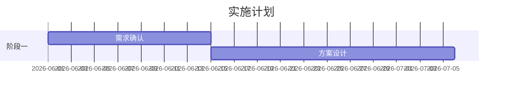

# /presales — 售前工作台

管理投标前期售前工作：客户需求分析、解决方案迭代、售前材料版本管理、需求冻结。

## 定位

| Skill | 职责 | 输出 |
|-------|------|------|
| `/prospect` | 线索管理 | 线索文档 |
| `/bid` | 投标建档 + 技术方案 + 商务报价 + 投标结果 | 投标档案骨架 |
| `/presales` | **售前工作台 — 需求→方案→材料→冻结** | 需求分析 + 解决方案 + 材料清单 |
| `/meeting` | 会议纪要（含售前技术交流）| 技术交流记录 |
| `/initiate` | 项目立项 | 项目结构 |

**典型工作流**:

```
/bid action=new（创建投标档案骨架）
    ↓
/presales（首次需求对接 → 更新客户需求分析）
/presales（方案成形 → 更新解决方案）
/presales action=material（材料版本管理）
/meeting type=tech-exchange（技术交流）
    ↓（循环迭代）↓
/presales action=lock（锁定需求）
    ↓
→ 进入 /bid 商务报价 + 投标结果阶段
```

---

### 投标状态推导（售前阶段）

`/presales` 负责投标状态中售前阶段的状态推导。AI 不静默设置状态，每次操作后通过双提议建议下一状态，用户确认或纠正。

| 状态 | 含义 | 触发条件 |
|------|------|----------|
| `needs-analysis` | 需求调研中 | `/bid action=new` 创建投标档案后 |
| `solution-drafting` | 方案编写中 | 首次更新 `解决方案.md` 内容后 |
| `solution-communicating` | 方案已发给客户 | `/presales action=material` 标记材料已发客户后 |
| `tech-exchange-loop` | 技术交流迭代中 | `/meeting type=tech-exchange` 完成后 |
| `requirement-locked` | 需求已冻结 | `/presales action=lock` 完成后 |

后续状态（`priced` → `submitted` → `won`/`lost`）由 `/bid` 管理。

**推导方法**：每次操作前，读取投标档案中已有文件判断当前状态；操作完成后在双提议中建议下一状态。

---

## Behavior

### Step 0: 确定动作

| action | 行为 |
|--------|------|
| 默认（无参数）| 交互式选择：更新「客户需求分析」或「解决方案」|
| `material` | 管理售前材料版本和客户反馈 |
| `lock` | 锁定需求，创建需求冻结确认书 |

---

### Step 1: 选择投标档案

如提供 `bid` 参数：

```bash
obsidian read path="投标档案/{bid}/客户需求分析.md"
obsidian read path="投标档案/{bid}/解决方案.md"
```

未提供时：

```bash
obsidian files folder="投标档案"
```

列出活跃投标档案供选择。

---

### Step 2: 更新客户需求分析 / 解决方案（默认动作）

#### 2a. 选择文档

```
要更新哪个文档？
1. 客户需求分析.md
2. 解决方案.md
```

#### 2b. 读取并更新

读取现有文档内容，根据用户输入更新对应 section。

#### 2c. 客户需求分析模板（若首次创建）

```markdown
---
title: "客户需求分析"
type: bid
client: "{{客户}}"
project: "{{主题}}"
tags:
  - type/bid
---

# 客户需求分析 — {客户} {项目名}

> 首次对接日期：YYYY-MM-DD | 最后更新：YYYY-MM-DD

## 基本信息

- 客户行业：
- 客户规模：
- 对接人：
- 对接人职务：
- 对接人角色：□决策人 □技术负责人 □使用部门 □其他

## 业务痛点

| 痛点 | 严重程度 | 客户原话 | 备注 |
|------|----------|----------|------|
| | 高/中/低 | | |

## 业务流程

[客户的核心业务流程是什么]

## 决策链

- 决策人：
- 技术拍板人：
- 使用部门：
- 可能反对的人：

## 技术约束

- 必须兼容的系统：
- 技术偏好（客户明确要求的）：
- 技术红线（不能接受的）：

## 竞争态势

- 客户正在对比的供应商：
- 客户倾向谁：
- 我们的机会点：

## 关键需求清单

| 需求 | 优先级 | 客户描述 | 我们能否满足 |
|------|--------|----------|--------------|
| | P0/P1/P2 | | 是/否/待确认 |

## 下次跟进计划

- 时间：
- 议题：
- 需准备：
```

#### 2d. 解决方案模板（若首次创建）

```markdown
---
title: "解决方案"
type: bid
client: "{{客户}}"
project: "{{主题}}"
tags:
  - type/bid
---

# 解决方案 — {客户} {项目名}

> 状态：构思中 / 初稿 / 已定稿
> 版本：v1 | 更新日期：YYYY-MM-DD

## 方案概述

[一句话描述如何解决客户的核心痛点]

## 客户痛点 vs 我们的方案

| 痛点 | 我们的解法 | 给客户带来的价值 |
|------|-----------|-----------------|
| 痛点1 | 方案A | 效率提升X% |

## 产品/服务配置

### 核心产品

| 产品 | 规格 | 数量 | 部署方式 |
|------|------|------|----------|
| | | | |

### 定制开发

| 开发项 | 工时 | 负责人 |
|--------|------|--------|
| | | |

## 实施路线图（可选）



## 风险与应对

| 风险 | 概率 | 影响 | 应对措施 |
|------|------|------|----------|
| | | | |

## 成功案例

- [[PJ-xxx]] — 同行业客户，解决了类似问题
- 效果：

## 方案版本记录

| 版本 | 日期 | 主要变化 | 备注 |
|------|------|----------|------|
| v1 | YYYY-MM-DD | 初稿 | |
```

#### 2e. 双提议

读投标档案已有文件，推导当前状态后：

```markdown
提议 1 — 关联建议：
1. 本次更新是否影响关联文档？（如 解决方案.md 更新后需同步更新 客户需求分析.md）
2. 是否需更新 售前材料清单.md 中的相关内容？

提议 2 — 后续行动：
1. 是否安排下一次技术交流？
2. 当前状态是否需要更新 售前材料清单 或进入 material 管理？
3. 🏷️ 投标状态建议：当前 {derived_state} → 建议 {next_state}（基于本次更新内容）

请回复编号确认，或纠正状态，或"跳过"
```

---

### Step 3: 管理材料版本（action=material）

#### 3a. 读取已有材料

```bash
obsidian files folder="投标档案/{bid}/售前材料"
obsidian read path="投标档案/{bid}/售前材料清单.md"
```

如售前材料清单不存在，先创建框架。

#### 3b. 记录新材料

与用户对话收集：

| 字段 | 说明 |
|------|------|
| 材料类型 | PPT / Word / Excel / PDF |
| 材料名称 | 如"方案汇报v2" |
| 版本 | 如"v2" |
| 存放路径 | attachments 下的实际路径 |
| 是否已发给客户 | 是/否 |
| 客户反馈 | 简要记录 |

#### 3c. 更新售前材料清单

```markdown
---
title: "售前材料清单"
type: bid
client: "{{客户}}"
project: "{{主题}}"
tags:
  - type/bid
---

# 售前材料清单 — {客户} {项目名}

## 版本记录

| 材料 | 类型 | 版本 | 日期 | 发给客户 | 客户反馈 |
|------|------|------|------|----------|----------|
| 方案汇报 | PPT | v1 | 05-01 | ✓ | 客户觉得太泛 |
| 方案汇报 | PPT | v2 | 05-08 | ✓ | |
| 功能清单 | Excel | v1 | 05-03 | ✓ | |
| 需求文档 | Word | v1 | 05-10 | ✓ | |

## 附件

- [[售前材料/方案汇报-v2-20260508.pptx]]
- [[售前材料/功能清单-v1-20260503.xlsx]]
```

#### 3d. 双提议

```markdown
提议：
1. 是否在「技术交流记录」中记录本次材料发送的客户反馈？
2. 是否需要更新「解决方案.md」中的版本记录？
3. 🏷️ 投标状态建议：→ solution-communicating（材料已发客户。如非首次发送，请忽略此条）

请回复编号确认，或纠正状态，或"跳过"
```

---

### Step 4: 锁定需求（action=lock）

#### 4a. 确认冻结内容

与用户对话收集：

| 字段 | 说明 |
|------|------|
| 需求版本 | 如"V1.0" |
| 冻结日期 | 默认今天 |
| 签字文件路径 | 客户签字版的存放路径 |
| 待确认项 | 还有哪些未完全确定的内容 |

#### 4b. 创建需求冻结确认书

文件路径：`投标档案/{bid}/需求冻结/需求冻结确认书.md`

```markdown
---
title: "需求冻结确认书"
type: bid
client: "{{客户}}"
project: "{{主题}}"
version: "V1.0"
freeze_date: YYYY-MM-DD
status: 已签字 | 待签字
tags:
  - type/bid
---

# 需求冻结确认书

> 项目：{客户} {项目名}
> 版本：V1.0
> 日期：YYYY-MM-DD
> 状态：□已签字 □待签字

## 需求版本

| 文档 | 版本 | 日期 |
|------|------|------|
| 需求规格说明书 | V1.0 | YYYY-MM-DD |
| 功能清单 | V1.0 | YYYY-MM-DD |
| 解决方案 | V1.0 | YYYY-MM-DD |

## 已确认范围

1.
2.

## 明确排除范围

1.

## 待确认项

| 待确认项 | 影响 | 决策时间 |
|----------|------|----------|
| | | |

## 双方签字

| 角色 | 姓名 | 签字 | 日期 |
|------|------|------|------|
| 客户方 | | | |
| 我方 | | | |

## 附件

- [[售前材料/需求冻结确认书-签字版.pdf]]
```

#### 4c. 更新相关文档

```bash
# 更新解决方案状态为"已定稿"
obsidian read path="投标档案/{bid}/解决方案.md"
# 追加版本记录：v1 已冻结

# 更新客户需求分析 - 标记需求已冻结
obsidian read path="投标档案/{bid}/客户需求分析.md"
```

#### 4d. 双提议

```markdown
✓ 确定性链接已自动建立：
- [[解决方案]] — 被锁定方案文档（同投标文件夹）
- [[客户需求分析]] — 被锁定需求文档（同投标文件夹）

提议：
1. 锁定需求后，是否可以开始进行工时测算和商务报价了？
   → 下一步：/bid action=update 更新商务报价
2. 是否需要通知下游合作团队？

🏷️ 投标状态建议：→ requirement-locked（需求已冻结）

请回复编号确认，或纠正状态，或"跳过"
```

---

## 与其他 Skill 的协作

| 场景 | 组合 |
|------|------|
| 投标建档后开始售前 | `/bid action=new` → `/presales` |
| 技术交流 | `/presales` → `/meeting type=tech-exchange` |
| 需求锁定后报价 | `/presales action=lock` → `/bid action=update` |
| 了解客户历史 | `/presales` 前 → `/query "客户X的历史合作"` |

---

## Notes

- `/presales` 依赖 `/bid action=new` 创建的投标档案骨架（文件夹 + 招标要求 + 技术方案 + 商务报价 + 投标结果）
- 售前材料统一存放在 `投标档案/.../售前材料/` 下
- 版本按日期管理，如 `方案汇报-v2-20260508.pptx`
- 需求锁定是售前到执行的分水岭，锁定后移交 `/bid` 进入商务报价阶段
- 客户需求分析和解决方案的内容将在 `/initiate` 立项时自动提取为方案承诺摘要和需求基线
