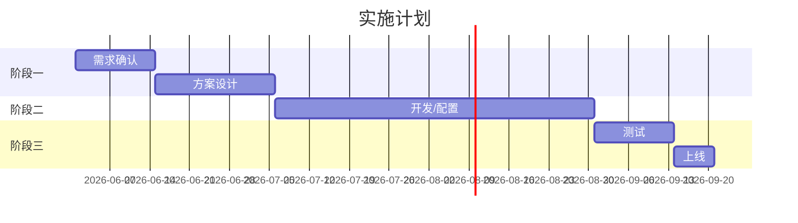

<!--
⚠️ 售前工作台核心文档
记录针对客户的定制化解决方案思路
-->

# 解决方案 — {客户} {项目名}

> 状态：构思中 / 初稿 / 已定稿
> 版本：v1 | 更新日期：YYYY-MM-DD

## 方案概述

[一句话描述如何解决客户的核心痛点]

## 客户痛点 vs 我们的方案

| 痛点 | 我们的解法 | 给客户带来的价值 |
|------|-----------|-----------------|
| 痛点1 | 方案A | 效率提升X% |

## 产品/服务配置

### 核心产品

| 产品 | 规格 | 数量 | 部署方式 |
|------|------|------|----------|
| | | | |

### 定制开发

| 开发项 | 工时 | 负责人 |
|--------|------|--------|
| | | |

## 实施路线图

## 风险与应对

| 风险 | 概率 | 影响 | 应对措施 |
|------|------|------|----------|
| | | | |

## 成功案例

- [[项目库/PJ-YYYY-NNN-项目名/00-项目章程|PJ-xxx]] — 同行业客户，解决了类似问题
- 效果：

## 方案版本记录

| 版本 | 日期 | 主要变化 | 备注 |
|------|------|----------|------|
| v1 | YYYY-MM-DD | 初稿 | |
